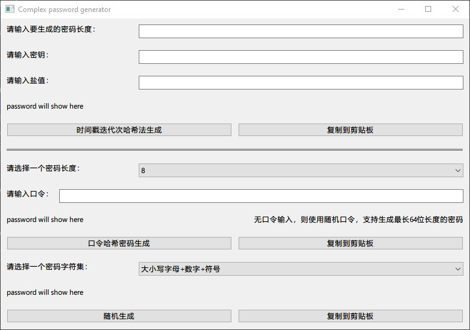

# 视频


<a href="https://www.bilibili.com/video/BV1gz4y1A7Ao/">密码堡垒：打造你的超级密码生成器</a>


# 初衷

发现谷歌的密码管理器生成复杂密码的功能很厉害。简单了解了一下常见的复杂密码生成算法有：随机密码生成器、基于字典的密码生成器、基于模式的密码生成器、基于口令的密码生成器，感觉谷歌的密码生成器应该是随机密码+模式密码生成。很有趣，但是从假想威胁出发，任何非离线并未开源的复杂密码生成的机构都不安全，甚至生成给你的复杂密码都会成为密码字典中的值。所以写一个本地的复杂密码生成器，有时间戳迭代次哈希法生成、口令哈希密码生成和随机生成密码三种方式。支持任意字符任意长度复杂密码生成，以及口令生成哈希值密码，方便自己记忆语句然后重新哈希得到密码。


# 界面

<p align="center"> <div align="middle"></div></p>


# 混合复杂密码生成器

## 时间戳迭代次哈希法生成

支持输入哈希密钥和盐值，防止彩虹表攻击。使用时间戳模一个值作为迭代次数，支持任意长度的密码生成。具体使用 PBKDF2（Password-Based Key Derivation Function 2）算法和 HMAC（Hash-Based Message Authentication Code）生成一个哈希值


## 随机密码生成器

<!-- ## 基于时间戳随机值下标访问惰性字典密码生成器 -->

支持选择指定字符集和密码长度生成随机密码。原理相当简单：通过random.choice在字符集中随机选择字符，生成密码

## 基于口令的密码生成器

采用SHA-256 哈希算法，SHA-256哈希的长度是64个字符。因为它是一个256位的哈希，每个十六进制字符代表4位，也就是一个ascii字符。因此支持生成最长64位长度的密码。


# 自编译

```
pip install -r requirements.txt
pip install update pyinstaller
pyinstaller --onefile --noconsole main.py --name ComplexPasswordGenerator
```

# 捐献

<p align="center"> <div align="middle"></div></p>

<p align="center"> <div align="middle"></div></p>